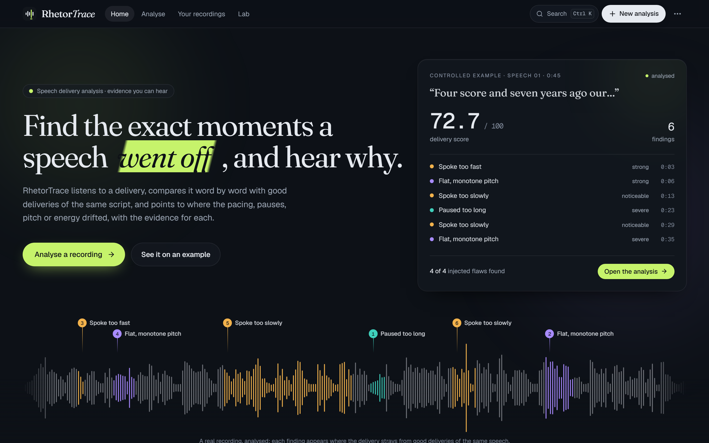
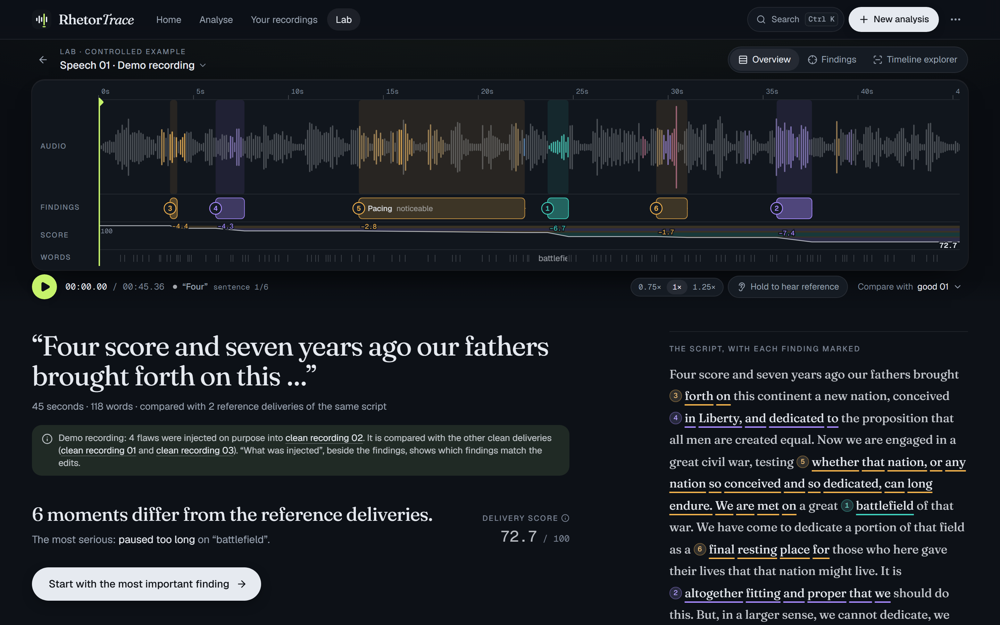
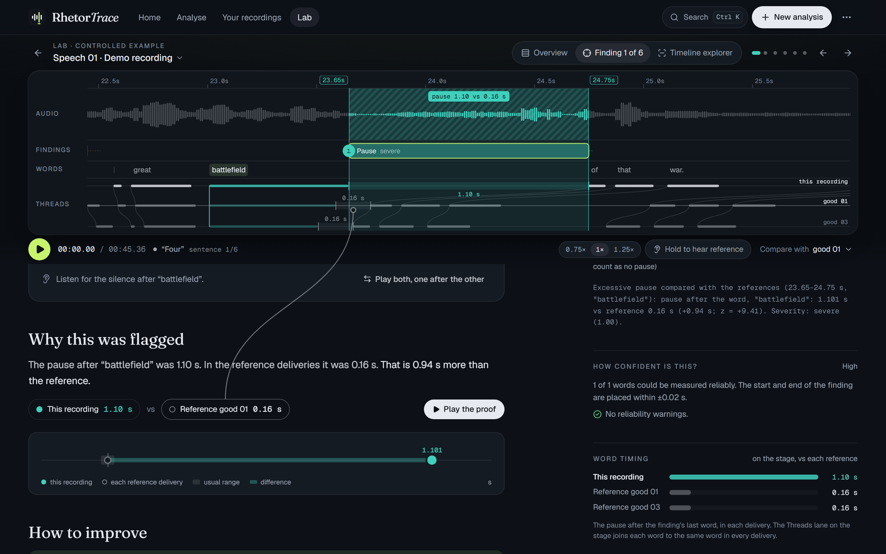
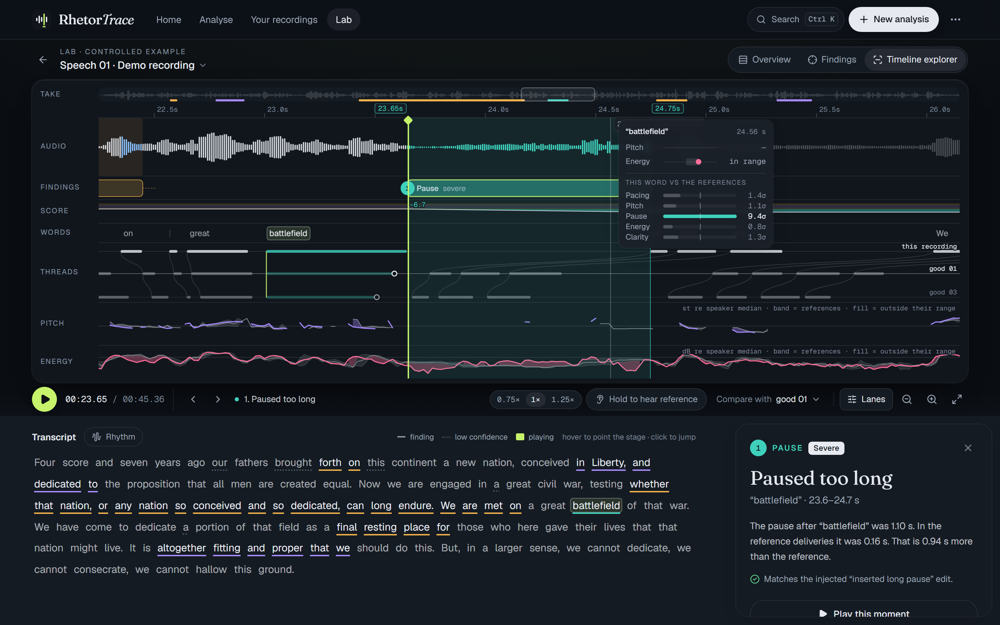
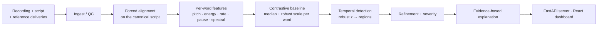
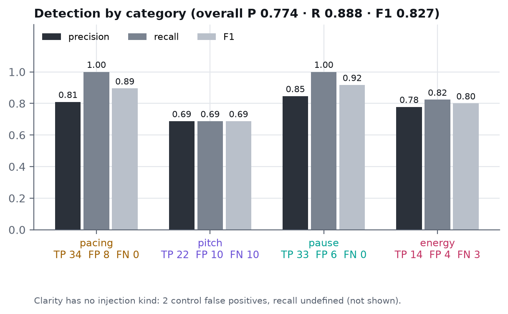
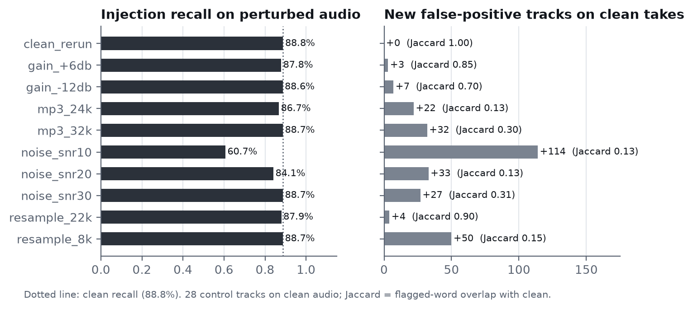

<div align="center">

# RhetorTrace

**Contrastive speech analytics with temporal flaw grounding.**
RhetorTrace compares a spoken delivery word by word with good deliveries of the same script, finds the
moments that went off, pins each one to its exact time span, and shows the measurement that caused it.

Multimodal AI Hackathon 2026 · Track C

[Demo](#demo) · [How it works](#how-it-works) · [Key results](#key-results) · [Setup](#setup) ·
[Run](#run) · [Limitations](#limitations)

</div>

---

## Demo

**Demo video:** _[TODO: link]_

| | |
|---|---|
|  |  |
| **Home**: a real recording analysed in front of you. Findings appear as the scan reaches them; the score falls by each finding's actual cost. | **Overview**: the recording stage. Waveform tinted where words deviate from the references, numbered findings, score through time, script with findings marked. |
|  |  |
| **Finding**: a 1.10 s pause where the reference speakers paused 0.16 s. Rhythm threads join each word to the same word in every reference; the claim is linked to the span where it was measured. | **Explorer**: every lane, with pitch and energy against the reference band, rhythm threads, and a readout of the measurements under the pointer. |

## What RhetorTrace is

Feedback on spoken delivery ("too fast", "monotone") is usually holistic and unverifiable, and fixed
norms such as "150 words per minute" ignore that good speakers legitimately differ. For scripted speech
(talks, pitches, read-aloud practice) the useful questions are concrete: **which words, how different,
compared with what, and how sure?**

RhetorTrace answers them by **contrast**. Given a recording and its script, it uses several good
deliveries of the *same* script as the reference: it aligns every delivery to the script, measures every
word, builds a tolerance band per word from how the good deliveries varied, and reports where the
recording leaves that band as **time-stamped findings** with category, direction, severity and the
evidence behind them, e.g. *"pause after 'battlefield': 1.101 s vs reference 0.16 s (+0.94 s;
z = +9.41). Severity: severe."* No language model judges the speech or writes the explanations.

## Why it is different

| | Typical delivery scoring | RhetorTrace |
|---|---|---|
| Reference | fixed norms (wpm, pitch range) | good deliveries of the **same text**, word by word |
| Output | one score | **time-stamped findings**: words, start/end ± uncertainty, category, direction, severity |
| Evidence | opaque | every finding lists measured values, reference values and the deviation |
| Explanations | LLM-generated text | **deterministic**: every number is a stored measurement |
| Normal variation | ignored | robust per-word scale from the references; leave-one-out controls measure false alarms |
| Validation | anecdotal | 126 injected flaws with ground truth, 6 clean controls, 10 audio stress conditions, reproducible reports |

## How it works



| step | module | what it does |
|---|---|---|
| Ingest / QC | `src/ingest.py` | converts audio to 16 kHz mono; checks duration, silence, clipping |
| Alignment | `src/alignment.py` | WhisperX wav2vec2 forced alignment on the **script**, so word *i* is the same word in every take; Whisper ASR only as a quality gate (off-script readings are refused) |
| Features | `src/features/` | per word: pitch (Praat, semitones re speaker), energy (dB re speaker), duration and local rate, pause after the word, MFCC and spectral shape; unmeasurable values are `null` with a reason, never 0 |
| Baseline | `src/baseline.py` | per word and feature: median over the references and a moderated robust scale (stable with only 3 references) |
| Detection | `src/detection.py` | robust z per word → per-category tracks (pacing, pitch, pause, energy, clarity) → 3-word running median → regions opening at z ≥ 3, extending at z ≥ 2 |
| Refinement | `src/flaws.py` | trims / extends boundaries on the evidence, adds per-side uncertainty, computes severity (5 levels) |
| Explanation | `src/explain.py` | strongest and supporting evidence, each reference delivery's own value, unavailable evidence with reasons |
| Serving | `src/server.py`, `web/` | FastAPI job server; React dashboard (overview, finding, explorer, lab) |

All thresholds live in [`config.yaml`](config.yaml), each with a comment on why it was chosen.

## Key results

Synthetic flaws injected into 6 good human deliveries, each scored against the *other* references
(leave-one-out). Source: [`results/validation/EVALUATION.md`](results/validation/EVALUATION.md),
generated by `python scripts/evaluate.py`.

| category | TP | FP | FN | precision | recall | F1 |
|---|---:|---:|---:|---:|---:|---:|
| pacing | 34 | 8 | 0 | 0.809 | 1.000 | 0.895 |
| pitch | 22 | 10 | 10 | 0.688 | 0.688 | 0.688 |
| pause | 33 | 6 | 0 | 0.846 | 1.000 | 0.917 |
| energy | 14 | 4 | 3 | 0.778 | 0.824 | 0.800 |
| clarity | 0 | 2 | 0 | 0.000 | n/a | n/a |
| **overall** | **103** | **30** | **13** | **0.774** | **0.888** | **0.827** |

| | |
|---|---|
| Temporal grounding | long / missing pause IoU **1.000** (exact); fast 0.954, quiet 0.952, slow 0.835, monotone 0.762 |
| Severity vs flaw strength | never decreases at **90 / 90** sites |
| Clean deliveries | 28 false-positive tracks over 6 takes (6.2 / min, 12.5 % of words) |
| Audio-edited demo recordings | **8 / 8** edits found (each demo also has 2 further findings) |



**Stress testing.** Every good take is degraded, re-aligned and re-analysed by the unchanged pipeline
([`results/validation/ROBUSTNESS.md`](results/validation/ROBUSTNESS.md)):

| condition | injection recall (clean 88.8 %) | new false-positive tracks |
|---|---:|---:|
| gain +6 dB / −12 dB | 87.8 % / 88.6 % | 3 / 7 |
| resample 22 kHz / 8 kHz | 87.9 % / 88.7 % | 4 / 50 |
| MP3 32k / 24k | 88.7 % / 86.7 % | 32 / 22 |
| white noise SNR 30 / 20 / 10 dB | 88.7 % / 84.1 % / 60.7 % | 27 / 33 / 114 |



## Dataset

* **Scripts**: Lincoln's *Gettysburg Address* (`speech_01`, 118 words) and an excerpt of Frederick
  Douglass's *What to the Slave Is the Fourth of July?* (`speech_02`, 122 words), both public domain.
* **Good human deliveries**: 3 per script (40.7–49.5 s), in `dataset/speech_*/audio/good_*.wav`
  (16 kHz mono; originals in `dataset/speech_*/raw/`). These are the exact files every result was
  computed from.
* **Audio-edited demo recordings**: `dataset/speech_*/audio/synth_01.wav`, a good take edited in Praat
  (sped up, slowed down, a 1 s pause inserted, pitch flattened): 8 labelled flaws, ground truth in
  `results/demo/`. Rebuilt by `python scripts/build_demo.py`.
* **Feature-level injections**: 126 flaws (fast, slow, quiet, monotone, mild monotone, long pause,
  missing pause; 3 sites in each of the 6 good takes) plus a 4-step severity ladder, generated
  deterministically by `scripts/eval_detection.py`.
* Cached pipeline outputs (alignments, features, baselines, detections, flaws) are in `results/`.

## Setup

**Prerequisites**

* Python 3.13 (tested with 3.13.1) and pip
* Node.js 22 and npm
* Internet access for installing dependencies (`requirements.txt` includes WhisperX and PyTorch)
* Tested on Windows

```bash
git clone <repository-url> rhetortrace
cd rhetortrace

python -m venv .venv
.venv/Scripts/activate              # macOS / Linux: source .venv/bin/activate
pip install -r requirements.txt

cd web && npm install && cd ..
```

`requirements.txt` is not pinned; the versions used for the reported results are recorded in
`results/validation/evaluation.json` (`metadata.libraries`): WhisperX 3.8.6, librosa 1.0.0,
NumPy 2.5.3, SciPy 1.18.1, praat-parselmouth 0.4.7, soundfile 0.14.0.

**Dashboard audio (once, after cloning).** The demo's audio files are generated from the committed WAVs
and cached alignments; no speech model is downloaded:

```bash
python -m src.features.pitch --all
python -m src.features.energy --all
python scripts/build_dashboard.py
```

## Run

```bash
# analysis server (port 8000)
python -m src.server

# dashboard: http://localhost:5173 (in a second terminal; proxies /api to the server)
cd web && npm run dev
```

The demo recordings and the Lab work without the server. To analyse your own recording, open
**New analysis** in the dashboard (upload a recording, its transcript and two or more good deliveries of
the same text), or use the command line:

```bash
python -m src.analyze --audio talk.wav --transcript script.txt --ref good1.wav --ref good2.wav
python -m src.analyze --audio talk.wav --references-from speech_01     # a dataset script's good takes
```

Analysing a new recording runs the alignment models, which are downloaded on first use. Each analysis is
saved in `runs/<run_id>/` with its inputs and every stage's output.

**Tests and reproducing the results**

```bash
pytest -q                     # Python test suite
python scripts/evaluate.py    # regenerates results/validation/EVALUATION.md from cached data
cd web && npm test            # dashboard unit tests
npm run build                 # type check + production build
npm run test:e2e              # end to end against the real analysis server
```

`scripts/evaluate.py` needs no audio or models, hashes the config, code and inputs into the report and
writes no timestamps: re-running it reproduces every metric exactly.

## Limitations

* **Synthetic flaws only.** There are no human recordings with natural, labelled flaws yet; results
  measure detection of controlled deviations.
* **Small reference set** (3 per script, 2 in leave-one-out): one atypical good delivery
  (`speech_02/good_01`) produces 16 of the 28 false positives on clean deliveries.
* **No held-out test set**: thresholds were chosen on the same controls and injections.
* **Pitch is the weakest category** (F1 0.688; mild flattening found 7 of 16 times).
* **Clarity and fillers/disfluencies** have no labelled flaws; spectral features are sensitive to noise
  and codecs.
* **Severity** is validated only for monotonicity in flaw strength, not against human ratings.
* Scripted English speech only (a transcript is required).

## Repository structure

```
src/            the analysis pipeline (features/, baseline, detection, flaws, explain, pipeline, server)
scripts/        dataset and evaluation workflow (alignment, demo build, evaluation, robustness, dashboard data)
dataset/        scripts, original recordings and the analysed 16 kHz audio
results/        cached pipeline outputs and validation reports
tests/          pytest suite
web/            React dashboard (Vitest, Playwright)
docs/           screenshots and figures used in this README, Devpost draft
config.yaml     every threshold and setting, commented
```
